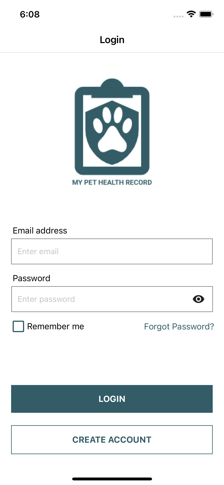
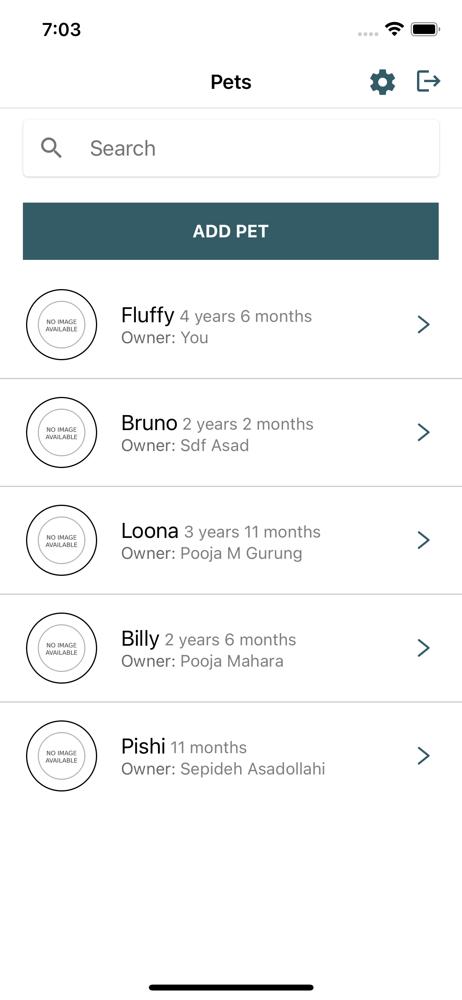
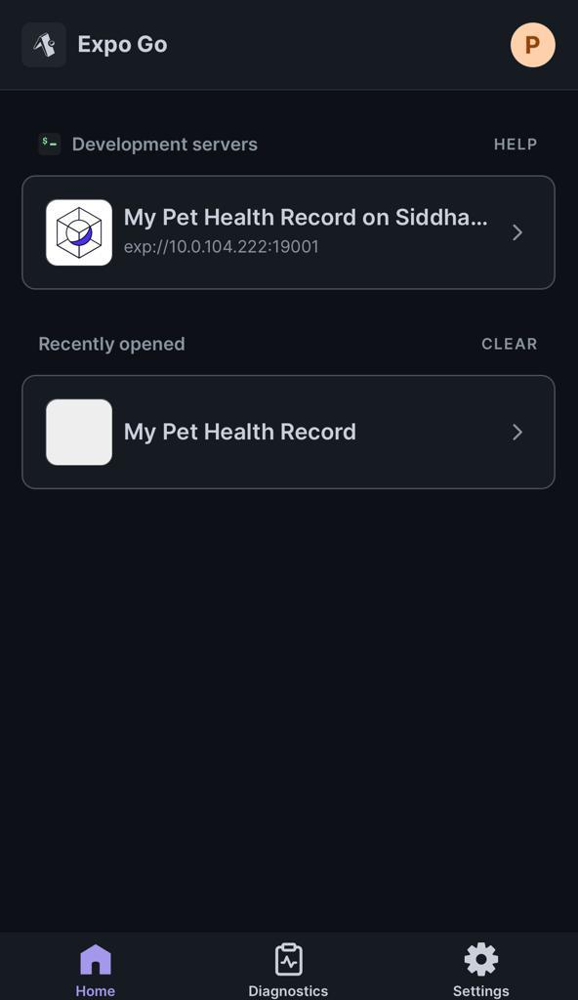

<a name="readme-top"></a>

<!-- TABLE OF CONTENTS -->
<details>
  <summary>Table of Contents</summary>
  <ol>
    <li>
      <a href="#about-the-project">About The Project</a>
      <ul>
        <li><a href="#built-with">Built With</a></li>
      </ul>
    </li>
    <li>
      <a href="#getting-started">Getting Started</a>
      <ul>
        <li><a href="#prerequisites">Prerequisites</a></li>
        <li><a href="#installation">Installation</a></li>
      </ul>
    </li>
    <li><a href="#usage">Usage</a></li>
    <li><a href="#roadmap">Roadmap</a></li>
    <li><a href="#contributing">Contributing</a></li>
    <li><a href="#license">License</a></li>
    <li><a href="#contact">Contact</a></li>
    <li><a href="#acknowledgments">Acknowledgments</a></li>
  </ol>
</details>


<!-- ABOUT THE PROJECT -->
## About The Project

<!-- [![Product Name Screen Shot][product-screenshot]] -->
<p align="center">
  
  
 </p>

A centralized pet medical record keeper. Pet owners can manage, view and share their pet's medical records.

<p align="right">(<a href="#readme-top">back to top</a>)</p>

### Built With

This project is made with:

* [![React][React.js]][React-url]
* [![Expo][Expo.dev]][Expo-url]
* [![Firebase][Firebase.google.com]][Firebase-url]
* [![VSCode][Code.VisualStudio.com]][VSCode-url]

<p align="right">(<a href="#readme-top">back to top</a>)</p>

<!-- GETTING STARTED -->
## Getting Started

### Prerequisites

* You must have a VS Code installed.
* Expo Go Account created.
* Expo Go installed in your iOS device.

### Installation

* Replace the firebase keys in the config/firebase-keys.js

#### Once you have replaced the firebase keys. Install npm

* npm
  ```sh
  npm install 
  ```
#### Login your Expo Go Account in both the terminal and iOS device.

Terminal:

  ```
  expo login
  ```

iOS device:

* just proceed to login your credentials

#### Once you have both credentials logged in 

in your terminal run: 
  ```
  expo start
  ```

in your device you should the app 



<p align="right">(<a href="#readme-top">back to top</a>)</p>

<!-- CONTACT -->
## Contact

Julian Sanchez - jsanchez.creatives@gmail.com

Sadaf Asadollahi - sadaf98x@gmail.com

Pooja Mahara - poojamahara1073@gmail.com

Project Link: [https://github.com/SadafAsad/MPHR](https://github.com/SadafAsad/MPHR)

<p align="right">(<a href="#readme-top">back to top</a>)</p>

<!-- MARKDOWN LINKS & IMAGES -->
[React.js]: https://img.shields.io/badge/React-20232A?style=for-the-badge&logo=react&logoColor=61DAFB
[React-url]: https://reactjs.org/
[Expo-url]: https://expo.dev/
[Expo.dev]: https://img.shields.io/badge/Expo-000020?style=for-the-badge&logo=expo&logoColor=white
[Vue-url]: https://vuejs.org/
[Firebase.google.com]: https://img.shields.io/badge/Firebase-white?style=for-the-badge&logo=firebase&logoColor=FFCA28
[Firebase-url]: https://firebase.google.com/
[Code.VisualStudio.com]: https://img.shields.io/badge/Visual_Studio_Code-black?style=for-the-badge&logo=visualstudiocode&logoColor=007ACC
[VSCode-url]: https://code.visualstudio.com/
